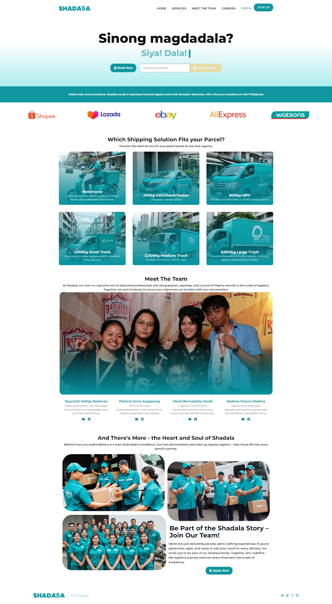

  
 
  A SAME-DAY LOGISTICS AND DELIVERY COURIER MANAGEMENT SYSTEM

## Project Overview

Shadala is a user-friendly and comprehensive web application designed to simplify and enhance the same-day logistics and delivery experience for businesses and individuals. The platform addresses a gap in the market for a service that seamlessly integrates technology, efficiency, and customer care, striving to revolutionize courier management and make it more efficient, reliable, and accessible.

## Key Features

- **Efficient Booking System**: Enables individuals and businesses to deliver items by booking courier services easily through the web application.
- **User-Friendly Interface**: Provides a seamless interface for users to input essential information and select suitable vehicles for their parcels.
- **Empowering Riders**: Offers job opportunities through the driver-side web app, allowing riders to join the network, fulfill delivery requests, and earn income.
- **Regional Focus**: Operates throughout accessible regions of Luzon, specializing in urgent parcel deliveries via road transport.
- **Comprehensive Service Management**: Supports customer and driver registration, delivery bookings, parcel detail input, and vehicle selection.
- **Admin Oversight**: Administrators manage user accounts, oversee driver registrations, and ensure smooth platform operations, maintaining reliable and secure services.

## Technologies Used
- 
- 
- 
- 

## Screenshots

  
  
  
  
  
  
  

## Team

This project was developed by:

- [Patricia Anne E. Sugapong](https://github.com/PatriciaSugapong)
- [Hyacinth Ashley G. Radovan](https://github.com/HyacinthAshleyRadovan)
- [Marie Bernadette M. Gerali](https://github.com/MarieGerali)
- [Stefano Franco A. Medina](https://github.com/stefanomedina17)
